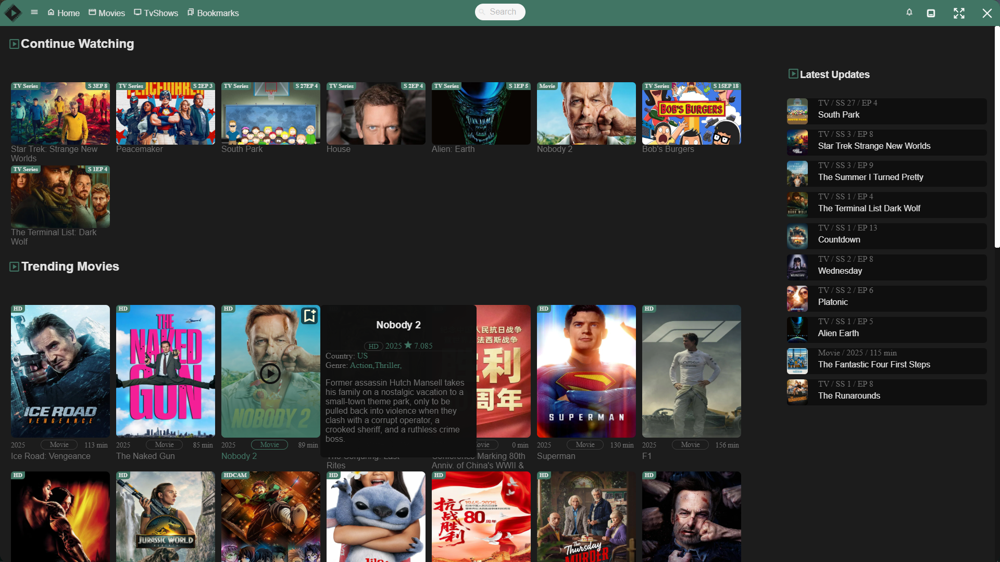
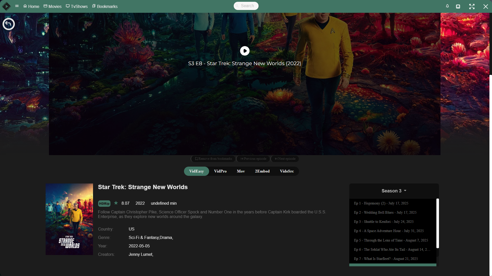
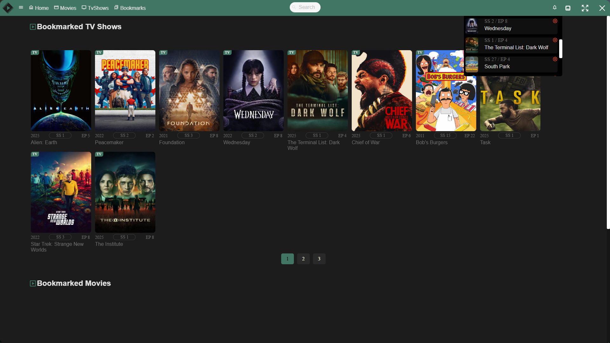

# Filmscape - opensource streaming desktop app

A desktop application that offers a seamless experience for watching embedded content. Has complete user interface with bookmarks and notifications, so you never miss an episode.

## Features

### Media & Streaming
- TMDB API integration for extensive movie and TV show data
- Multiple provider support (VidEasy, VidLink, VidSrc, VidSrc Pro)

### User Experience
- Watchlist
- Bookmarks
- Notifications
- Application Color wheel

## Instalation
- Download latest release for your operating system
- Unpack the zip file
- Run the application from Filmscape.exe

## License

This project is licensed under the MIT License.

## ⚠️ Legal Disclaimer

This project is provided strictly for research and educational purposes only. By using this software:

- You acknowledge that this is a research project and agree to use it in compliance with all applicable local, state, and federal laws.
- You understand that the author(s) provide this code "as is" without warranty of any kind, express or implied.
- You accept full responsibility for any use, misuse, or illegal use of this software.
- You agree that the author(s) cannot be held liable for any damages, legal issues, or consequences arising from the use of this software.
- You acknowledge that this project does not include, distribute, or promote any copyrighted or unlawful material.
- You understand that streaming copyrighted content without proper authorization may be illegal in your jurisdiction.
- You agree to use this software only with properly licensed and authorized content in accordance with your local laws.

The purpose of this project is to demonstrate modern web development techniques and architectures. Any actions and/or activities related to the material contained within this project is solely your responsibility.
